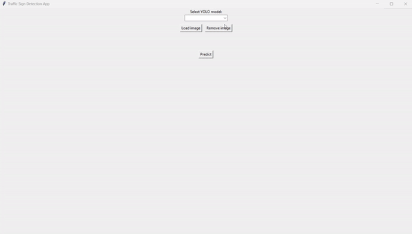

# Traffic-Signs-Detection with YOLOv10

### Overview

This project, developed for the Machine Learning course at the University of Catania (Academic Year 2023-2024), focuses on traffic sign detection using YOLOv10. The aim is to evaluate and compare the performance of three different YOLOv10 models: YOLOv10n, YOLOv10s, and YOLOv10m.

### Project Description

The project utilizes YOLOv10, a state-of-the-art object detection model, to identify traffic signs in images. YOLOv10 is known for its accuracy and efficiency in object detection tasks. This project specifically addresses traffic sign detection, which is crucial for autonomous driving systems and traffic management.

### Project Features

- **Model Comparison:** The project compares the performance of three YOLOv10 models:
  - **YOLOv10n:** A smaller and faster version, optimized for real-time applications.
  - **YOLOv10s:** A balanced version that provides a trade-off between speed and accuracy.
  - **YOLOv10m:** A larger model with enhanced accuracy, suitable for detailed detection tasks.
- **Object Detection:** Detect and classify traffic signs in images.
- **Ground Truth Comparison:** Visualize the detected signs alongside ground truth annotations to evaluate model performance with a Python app.

## Requirements

To run this project, you need to install the following Python packages. You can install them using `pip`:
```bash
pip install -r requirements.txt

## Training Demo (.ipynb Notebook)

The `Notebook.ipynb` file provides a practical demonstration of training and validating the YOLOv10 models used in the project. The notebook guides through the following phases:

1. **Model Training**: 
   - It uses the [GTSDB](https://benchmark.ini.rub.de/gtsdb_dataset.html) dataset to train the YOLOv10n, YOLOv10s, and YOLOv10m models.
   - The notebook shows how to initialize and train each model using the specified dataset.

   If you wish to train the models on a different dataset, place your dataset in the `datasets` folder, modify the `data.yaml` file to point to the new dataset, and ensure that you maintain the structure described in the project report.

2. **Model Validation**:
   - It performs validation of the trained model using a custom dataset of traffic signs.
   - Then, notebook demonstrates how to calculate and visualize performance metrics such as mAP, precision, recall, and F1 Score.

3. **Metrics Comparison**:
   - It compares the mAP, precision, recall, and F1 Score metrics among the different YOLOv10 models to determine their relative performance.

4. **Visual Testing**:
   - It conducts visual testing on traffic sign images collected for the project to evaluate the accuracy of the models' predictions on real images.


## **Traffic Sign Detection App**

The Traffic Sign Detection app is a graphical user interface (GUI) built with Tkinter, designed for traffic sign detection using YOLOv10. This application allows you to:

- **Load and Display Images**: You can load images of traffic signs, which will be displayed along with their ground truth annotations.
- **Predict Traffic Signs**: The application uses YOLOv10 models to make predictions on the loaded images and display the results.
- **Visualize Predictions**: Predictions are shown alongside the original image and the ground truth annotations. The results include bounding boxes and class labels.

### **Running the Application**

To use the Traffic Sign Detection Application, you need to execute the following command:

```bash
python signDetectionApp.py

### **Requirements**

Make sure you have the necessary packages installed. You can do this by using the `requirements.txt` file included in the project.


## Example



## Contributing

Contributions are welcome! Please open an issue or submit a pull request for any improvements or bug fixes.
